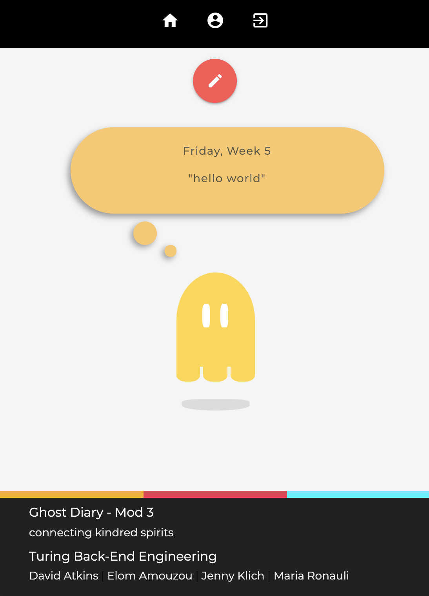
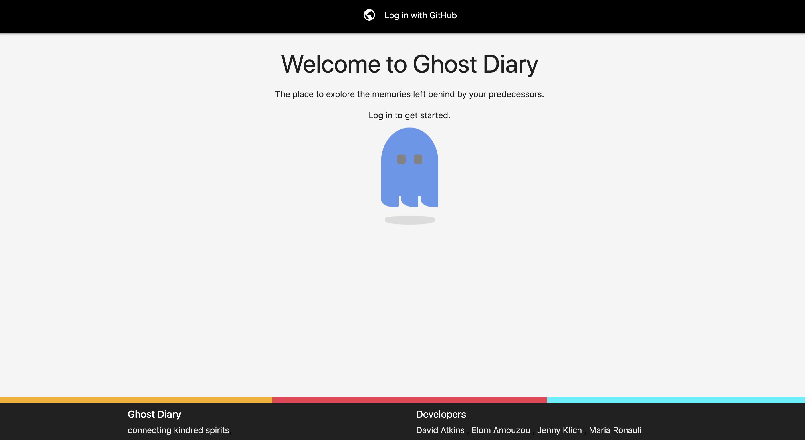
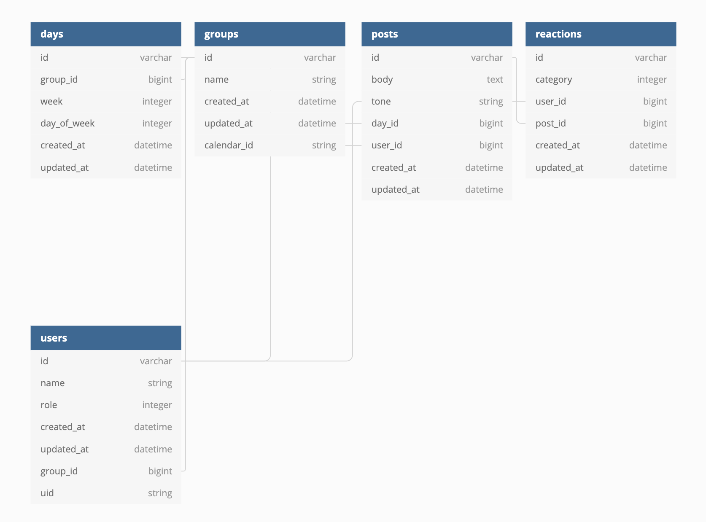

# README

## Description
Ghost Diary is a microblogging platform with a twist: you don't communicate directly with anyone and you don't need any friends or followers; you just need to belong to a program.

Instead of sorting posts by date posted, Ghost Diary organizes posts by the relative day and week of a program. For example, someone going through Wednesday, Week 4 of a software design school is able to:
1. see the posts made by people who are going through/have already been through that same day of that same program, and
2. make posts that others in the future will be able to read when they, themselves, are going through that same day.

As students who are a part of an intensive tech program, we are caught in a constant battle against adversity: we withstand crushing pressure and celebrate exhausting wins on the regular. It's natural to wonder how everyone else is doing when under such great stress, but it can feel troublesome to constantly pester your peers for something so little. Ghost Diary aims to solve this problem.

Ghost Diary is a greenfield project that began as an idea and has been realized as a full-featured, professional application.

The back-end was built with Ruby on Rails and Sinatra, Materialize was used to add a little polish to the front-end, and users authenticate through GitHub via OmniAuth.

[David Atkins](https://github.com/d-atkins), [Elom Amouzou](https://github.com/eamouzou), [Jenny Klich](https://github.com/jklich151), [Maria Ronauli](https://github.com/mronauli)

### [View Ghost Diary in Production](https://turing-ghost-diary.herokuapp.com/)


## Schema


## Getting Started

#### Requirements:
- Ruby 2.5.1
- PostgreSQL 12.1
- Redis

#### Installation:

```
$ git clone https://github.com/d-atkins/ghost-diary-gateway.git   
$ cd ghost-diary-gateway  
$ gem install bundler   
$ bundle   
$ rails db:{drop,create,migrate,seed}   
$ bundle exec figaro install   
```
If you have problems bundling, try deleting `Gemfile.lock`

## Environment Setup:
Ghost Diary consumes the Google Calendar API and IBM Tone Analyzer. Internet connection required. In order to run in development, you will need to set up your environment variables.

##### You will need the following:
Tone Analyzer key: [Watson Tone Analyzer](https://www.ibm.com/watson/services/tone-analyzer/)

Google API key: [Google API Key](https://support.google.com/googleapi/answer/6158862?hl=en)

GitHub OAuth App: [Github OAuth App](https://developer.github.com/apps/building-oauth-apps/creating-an-oauth-app/)
> To test in development, set the Authorization callback URL to `http://localhost:3000/auth/github/callback`

Add the following environment variables to your `config/application.yml` file. Insert the relevant values in place of 'insert_here'.  

```
GITHUB_CLIENT_ID: 'insert_here'   
GITHUB_CLIENT_SECRET: 'insert_here'   
ANALYZER_API_KEY: 'insert_here'   
GOOGLE_API_KEY: 'insert_here'   
TONE_SERVICE_DOMAIN: https://turing-ghost-tone.herokuapp.com **
```

** if you want to run this app with a local microservice, then set this variable as: `TONE_SERVICE_DOMAIN: http://localhost:9292` and follow the instructions for "Running in Development" found in [Ghost Diary Tone Service](https://github.com/d-atkins/ghost-diary-tone-service).

## Tests
To run the test suite, run the following command: `bundle exec rspec`. You must be connected to the internet and your environment variables must be set up correctly for the `/spec/services` tests to pass. The same applies for running the app in development.

## Development
To run Ghost Diary in development, execute the following commands from the project directory (you will need three separate tabs):
```
$ redis-server
$ bundle exec sidekiq
$ rails s
```
Visit `http://localhost:3000` to view the application in development.
To view our application in production, visit [Ghost Diary](https://turing-ghost-diary.herokuapp.com/) on Heroku.

## Tools

#### Notable Gems:
* OmniAuth-Github
* Faraday
* Figaro
* Materialize
* Will_paginate
* Sidekiq

#### Testing:
* SimpleCov
* Capybara
* RSpec
* Shoulda-matchers
* Factory bot
* Faker

Continuous Integration with Travis-CI

Deployed on Heroku

## Next Steps
* Responsive web design - get Ghost Diary looking good on phones!
* Search by tags - be able to filter posts by hashtags

## Contributors
* [David Atkins](https://github.com/d-atkins)
* [Elom Amouzou](https://github.com/eamouzou)
* [Jenny Klich](https://github.com/jklich151)
* [Maria Ronauli](https://github.com/mronauli)

## Acknowledgments
* [Brian Zanti](https://github.com/BrianZanti)
* [Dione Wilson](https://github.com/dionew1)

#### [Project Specifications](https://backend.turing.io/module3/projects/terrificus/)
